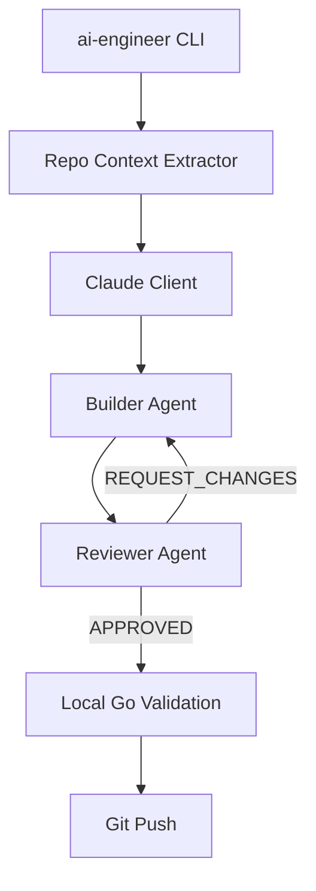
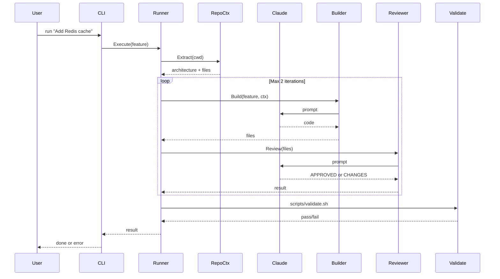

# AI Agents Go SDK Plan

## Architecture Overview




## Module Layout

```
ai-agents-sdk/
├── go.mod                    # module github.com/yourorg/ai-agents-sdk
├── ARCHITECTURE.md
├── cmd/
│   └── ai-engineer/
│       └── main.go
├── ai/
│   ├── agents/
│   │   ├── builder.go
│   │   └── reviewer.go
│   ├── llm/
│   │   └── claude_client.go
│   ├── context/
│   │   └── repo_context.go
│   └── runner/
│       └── go_runner.go
└── scripts/
    └── validate.sh
```

**Install**: `go install github.com/yourorg/ai-agents-sdk/cmd/ai-engineer@latest`  
**Usage**: `ai-engineer run "Add Redis cache to user profile API"`

---

## 1. Module Setup

- `go mod init github.com/yourorg/ai-agents-sdk`
- Dependencies: `github.com/anthropics/anthropic-sdk-go`, `golang.org/x/tools` (optional for file tree)
- Go 1.22+

---

## 2. Claude Client (`ai/llm/claude_client.go`)

- Wrap `anthropic-sdk-go` Messages API
- Responsibilities: send prompts, receive responses, **manage token limits**
- Token logic:
  - `MaxTokens` in request (e.g. 4096 for output)
  - Track input size: sum system + user message tokens; reject or truncate if over limit (e.g. 180K context for Claude 3.5 Sonnet)
- Use `anthropic.ModelClaude35Sonnet20241022` (or current Sonnet model ID)
- Config: API key from `ANTHROPIC_API_KEY` env var

---

## 3. Repo Context Extractor (`ai/context/repo_context.go`)

- **Goal**: Send only relevant files to reduce tokens
- Read `ARCHITECTURE.md` from project root (or `./ARCHITECTURE.md` relative to cwd)
- Scan repo for `.go` files; filter by:
  - Feature description (keyword/vector similarity—start with simple keyword matching)
  - Max files cap (e.g. 10–15 files)
  - Exclude `vendor/`, `_test.go` (unless tests are in scope), generated code
- Return: `{ Architecture string, Files []FileContent }` where `FileContent` = path + content
- Use `context.Context` for cancellation

---

## 4. Builder Agent (`ai/agents/builder.go`)

- Prompt template (exact):

```
You are a senior Go engineer.

Task:
{{feature}}

Architecture:
{{ARCHITECTURE.md}}

Relevant files:
{{files}}

Requirements:
- idiomatic Go
- table-driven tests
- use context.Context
- avoid global state

Return updated files and tests.
```

- Input: feature string, architecture string, file list
- Output: updated file contents (structured: path → content) + tests
- Use `claude_client.Send()` with system + user messages
- Parse response into map of file path → content (support markdown code blocks with path hints)

---

## 5. Reviewer Agent (`ai/agents/reviewer.go`)

- Prompt template:

```
You are a strict Go reviewer.

Review the code and tests.

Check for:
- logical bugs
- race conditions
- missing edge cases
- incomplete tests

If problems exist:
Explain clearly and propose fixes.

If good:
Return APPROVED.
```

- Input: code + tests from Builder
- Output: `APPROVED` or `REQUEST_CHANGES` + feedback text
- Parse response for `APPROVED` vs `REQUEST_CHANGES`; extract feedback for Builder

---

## 6. Runner / Debate Loop (`ai/runner/go_runner.go`)

- Orchestrate flow:
  1. Extract repo context
  2. Call Builder
  3. Call Reviewer
  4. If `REQUEST_CHANGES` and iteration < 2: call Builder again with feedback, then Reviewer
  5. **Max 2 iterations** (hard cap)
  6. If still `REQUEST_CHANGES` after 2 iterations: fail and report

---

## 7. CLI (`cmd/ai-engineer/main.go`)

- Subcommands:
  - `ai-engineer run "<feature>"` — run full pipeline
- Flags: `--dry-run`, `--max-files`, `--max-tokens`
- Flow:
  1. Run Builder → Reviewer loop (via `runner`)
  2. Write files to disk (or temp dir first)
  3. Run `scripts/validate.sh` (or configurable path)
  4. If validation passes: optional `git add`, `git commit`, `git push` (configurable)
- **Reliability rules**:
  - AI never decides if tests pass → always run `validate.sh`
  - Go tools validate everything
  - Limit context files (from `repo_context`)
  - Limit debate loops (max 2)

---

## 8. Validate Script (`scripts/validate.sh`)

```bash
#!/bin/bash
set -e
echo "Formatting"
go fmt ./...
echo "Vet"
go vet ./...
echo "Lint"
golangci-lint run
echo "Test"
go test ./...
echo "Coverage"
go test -cover ./...
```

- CLIs should invoke this from project root; ensure `golangci-lint` is installed or document as requirement.

---

## 9. ARCHITECTURE.md

- Add minimal template describing project structure, conventions, and key packages
- Used by Builder and Repo Context for token-efficient context

---

## 10. Token-Saving Logic Summary


| Layer         | Strategy                                      |
| ------------- | --------------------------------------------- |
| Repo Context  | Cap files (~10–15), keyword-based relevance   |
| Architecture  | Single file (`ARCHITECTURE.md`), no full tree |
| Claude Client | Enforce `MaxTokens`, input size checks        |
| Debate Loop   | Max 2 iterations                              |


---

## Data Flow (Typical Run)




---

## Files to Create (in order)

1. `go.mod`
2. `ARCHITECTURE.md` (template)
3. `ai/llm/claude_client.go`
4. `ai/context/repo_context.go`
5. `ai/agents/builder.go`
6. `ai/agents/reviewer.go`
7. `ai/runner/go_runner.go`
8. `cmd/ai-engineer/main.go`
9. `scripts/validate.sh`

Jenkins pipeline is skipped per your choice (external pipeline).