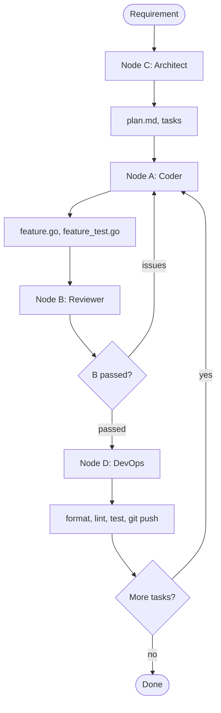

# LangGraph Pipeline Migration Plan

## Architecture Overview




## Project Structure (Python, replaces Go)

```
/
├── pyproject.toml          # Poetry or pip, langgraph, anthropic, ...
├── requirements.txt
├── src/
│   └── pipeline/
│       ├── __init__.py
│       ├── main.py         # CLI entry, argparse
│       ├── state.py        # TypedDict state schema
│       ├── graph.py        # StateGraph, nodes, edges
│       ├── nodes/
│       │   ├── architect.py  # Node C
│       │   ├── coder.py     # Node A
│       │   ├── reviewer.py  # Node B
│       │   └── devops.py    # Node D
│       ├── tools/          # gosec, golangci-lint, git (Jenkins placeholder)
│       │   ├── gosec.py
│       │   ├── lint.py
│       │   ├── validate.py # runs scripts/validate.sh or equiv
│       │   └── git_push.py
│       └── llm/            # Claude client wrapper
│           └── claude.py
├── config.py               # Root dir, API key, model, Jenkins URL placeholder
├── scripts/
│   └── validate.sh         # Keep for D to call
└── docs/
    └── HOWTO.md            # Updated for Python pipeline
```

## State Schema

```python
# state.py
class PipelineState(TypedDict):
    requirement: str              # Original user request
    plan_md: str                  # From C: architecture + plan
    tasks: list[dict]             # [{id, description, files: [...]}]
    current_task_idx: int
    files: dict[str, str]         # path -> content (from A)
    review_issues: list[str]      # From B; empty => passed
    iteration: int                # For max iterations guard
```

## Node Specifications

### Node C (Architect)

- **Input**: `requirement`
- **Action**: Call Claude with system prompt: "You are a senior Go engineer. Given the requirement, produce: 1) plan.md (architecture), 2) JSON list of tasks with descriptions and target files."
- **Output**: `plan_md`, `tasks`, `current_task_idx=0`
- **Logging**: `[ARCHITECT] planning for: {requirement[:80]}...`

### Node A (Coder)

- **Input**: `plan_md`, `tasks`, `current_task_idx`, `files` (if iteration>0), `review_issues`
- **Action**: Load relevant Go files from repo (reuse extractor logic in Python). Call Claude to implement `tasks[current_task_idx]`; output `<<FILE path>>...<<END>>`.
- **Output**: `files` (parsed from response)
- **Logging**: `[CODER] task {idx}: {desc[:50]}...`

### Node B (Reviewer)

- **Action**:
  1. Run `gosec ./...` (subprocess), capture output
  2. Call Claude with system prompt: "Review Go code. Check logic, race conditions, edge cases. Run gosec results: {output}. First line: VERDICT: APPROVED or VERDICT: REQUEST_CHANGES."
- **Output**: `review_issues` (empty if APPROVED, else feedback text)
- **Logging**: `[REVIEWER] gosec + LLM review`

### Conditional Edge (B → A or D)

- If `review_issues` non-empty and `iteration < max_iterations`: route to A
- Else if `review_issues` non-empty and `iteration >= max`: fail with feedback
- Else: route to D

### Node D (DevOps)

- **Action**:
  1. Write `files` to disk
  2. `go fmt ./...`
  3. `golangci-lint run`
  4. `go test ./...`
  5. Git add, commit, push (configurable; skip if `--dry-run`)
  6. Jenkins: placeholder env `JENKINS_URL`, `JENKINS_JOB`, `JENKINS_TOKEN`; no-op if unset
- **Output**: State unchanged; optionally `tasks_completed`
- **Logging**: `[DEVOPS] format, lint, test, push`
- **Next**: If more tasks → increment `current_task_idx`, route to A; else → END

## Key Files to Create


| File                 | Purpose                                                                                   |
| -------------------- | ----------------------------------------------------------------------------------------- |
| `state.py`           | TypedDict `PipelineState`                                                                 |
| `graph.py`           | `StateGraph(PipelineState)`, `add_node`, `add_conditional_edges`, `compile(checkpointer)` |
| `nodes/architect.py` | C: requirement → plan + tasks                                                             |
| `nodes/coder.py`     | A: task + context → files                                                                 |
| `nodes/reviewer.py`  | B: files → gosec + LLM → issues                                                           |
| `nodes/devops.py`    | D: files → format, lint, test, git                                                        |
| `tools/*.py`         | Subprocess wrappers for gosec, golangci-lint, validate.sh                                 |
| `llm/claude.py`      | Anthropic SDK wrapper (or ChatAnthropic from langchain-anthropic)                         |
| `main.py`            | `argparse`: `--dry-run`, `--root-dir`, `--verbose`, `requirement` positional              |


## Dependencies (requirements.txt)

```
langgraph
langchain-core
langchain-anthropic
anthropic
```

## Logging Strategy

- Default: verbose. Each node logs: `[NODE_NAME] <short description>`
- Optional `--verbose` (or env `PIPELINE_VERBOSE=1`): also log truncated prompts/responses (e.g. first 200 chars)
- Use Python `logging` with level INFO; no silent steps

## Config / Env Vars


| Env                                           | Purpose                        |
| --------------------------------------------- | ------------------------------ |
| `ANTHROPIC_API_KEY`                           | Claude API                     |
| `ROOT_DIR`                                    | Go project root (default: cwd) |
| `PIPELINE_DRY_RUN`                            | Skip writes, git push          |
| `JENKINS_URL`, `JENKINS_JOB`, `JENKINS_TOKEN` | Placeholder; no-op if unset    |


## Migration Steps

1. Create Python project layout and `pyproject.toml` / `requirements.txt`
2. Implement `state.py` and `llm/claude.py`
3. Port extractor logic to Python (or minimal: read ARCHITECTURE.md + top N .go files by keyword match)
4. Implement nodes C, A, B, D and tools (gosec, golangci-lint, validate, git)
5. Wire graph: `C -> A -> B -> (conditional) -> A|D -> (conditional) -> A|END`
6. Implement `main.py` CLI
7. Update docs; remove or archive Go code after validation

## What Gets Removed

- Entire `ai/`, `cmd/`, `sdk/` Go packages
- `go.mod`, `go.sum`
- Keep: `scripts/validate.sh` (D will call it), `ARCHITECTURE.md` as template/convention

